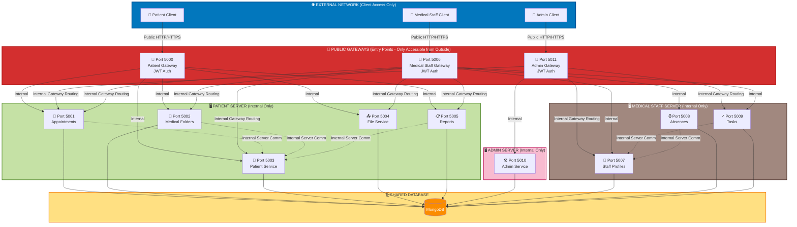
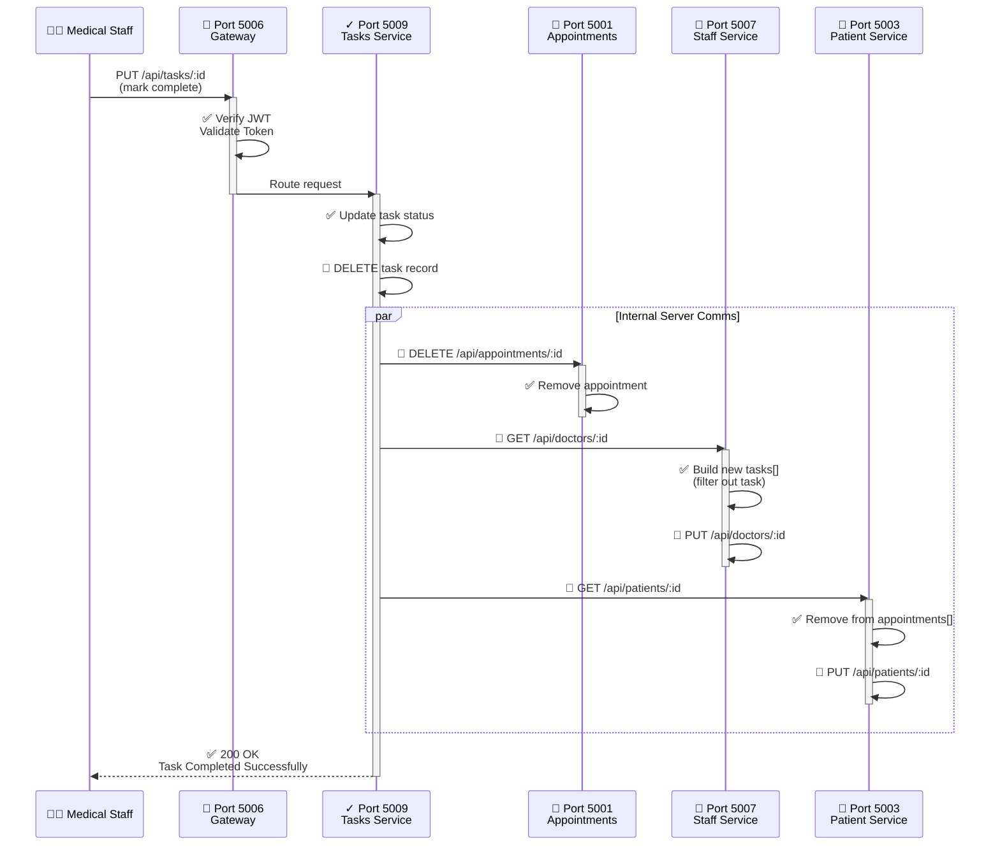
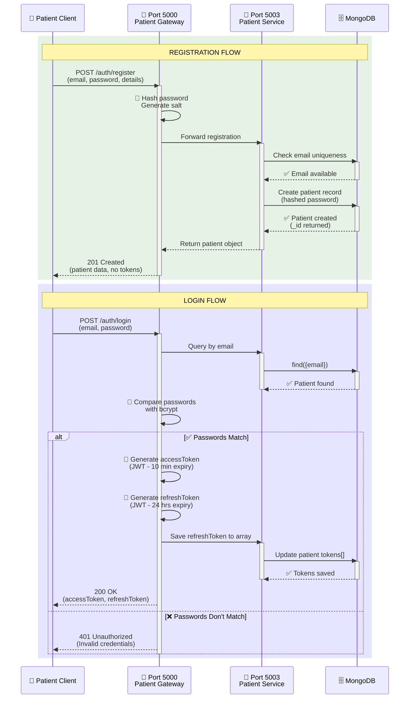
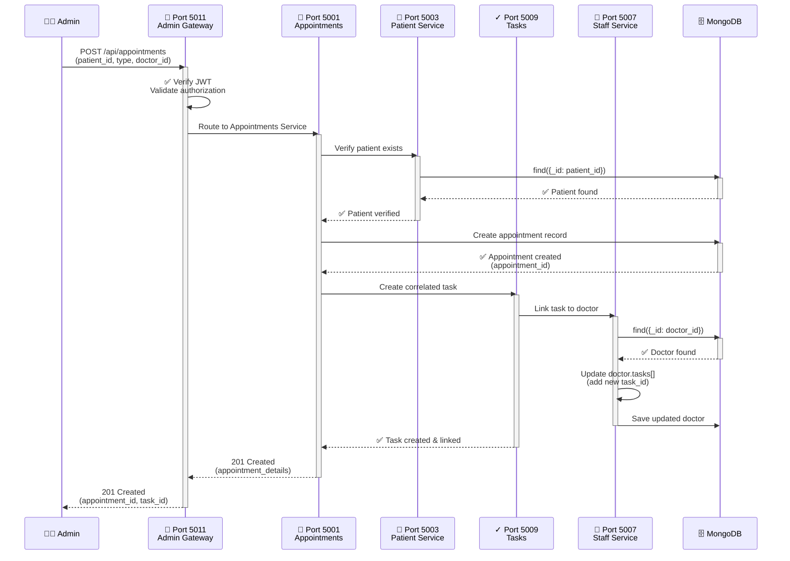
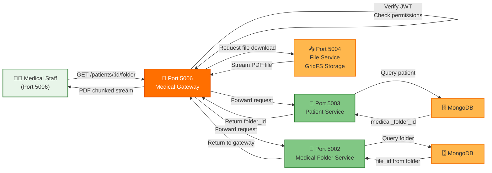
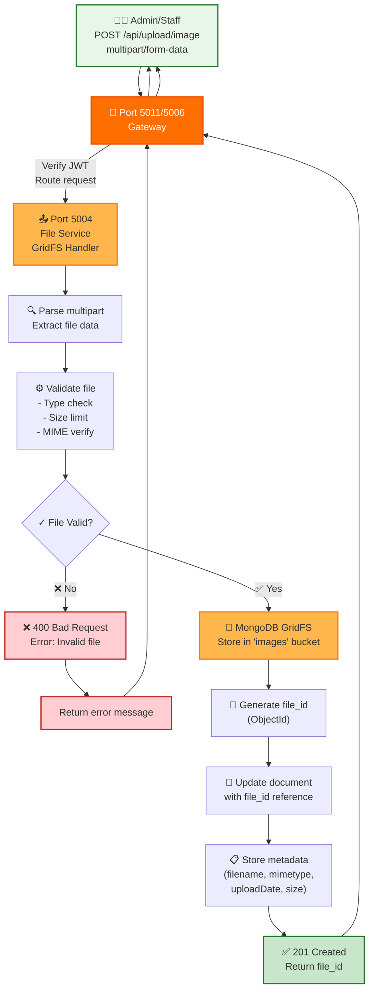
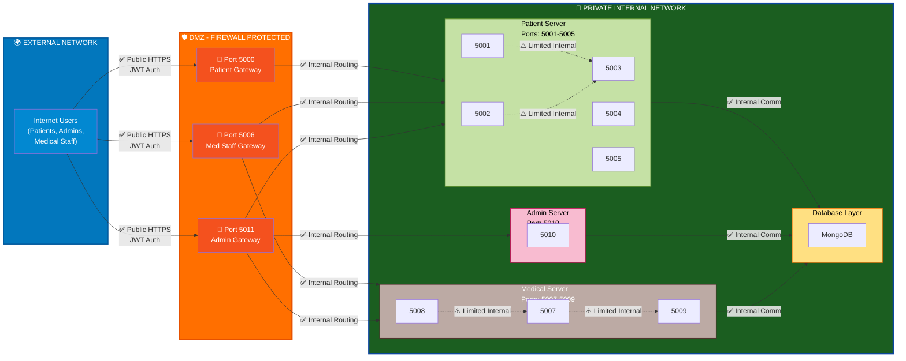

# CareHouse System Architecture - Mermaid Diagram

## System Overview

---

## Task Completion Cascading Flow

---

## Patient Registration & Login Flow

---

## Appointment Creation & Task Assignment

---

## Medical Folder Download Flow

---

## File Upload to GridFS

---

## Inter-Service Communication Matrix (Access Control)

```mermaid
graph TB
    subgraph PublicGateways["🔐 PUBLIC GATEWAYS (External Access Only)"]
        S5000["🚪 Port 5000<br/>Patient Gateway"]
        S5006["🚪 Port 5006<br/>Medical Staff Gateway"]
        S5011["🚪 Port 5011<br/>Admin Gateway"]
    end

    subgraph PatientServices["🖥️ PATIENT SERVER (Port 5001-5005)"]
        S5001["📅 5001: Appointments"]
        S5002["📁 5002: Medical Folders"]
        S5003["👤 5003: Patient Service"]
        S5004["📤 5004: File Service<br/>(GridFS)"]
        S5005["📋 5005: Reports"]
    end

    subgraph AdminServices["🖥️ ADMIN SERVER (Port 5010)"]
        S5010["🛠️ 5010: Admin Service"]
    end

    subgraph MedicalServices["🖥️ MEDICAL SERVER (Port 5007-5009)"]
        S5007["🏥 5007: Staff Profiles"]
        S5008["⏰ 5008: Absences"]
        S5009["✓ 5009: Tasks"]
    end

    %% PATIENT GATEWAY ROUTING
    S5000 -->|Route & Authenticate| S5001
    S5000 -->|Route & Authenticate| S5002
    S5000 -->|Route & Authenticate| S5003
    S5000 -->|Route & Authenticate| S5004
    S5000 -->|Route & Authenticate| S5005

    %% ADMIN GATEWAY ROUTING
    S5011 -->|Route & Authenticate| S5010
    S5011 -->|Route & Authenticate| S5001
    S5011 -->|Route & Authenticate| S5007
    S5011 -->|Route & Authenticate| S5009

    %% MEDICAL STAFF GATEWAY ROUTING
    S5006 -->|Route & Authenticate| S5007
    S5006 -->|Route & Authenticate| S5008
    S5006 -->|Route & Authenticate| S5009
    S5006 -->|Route & Authenticate| S5001
    S5006 -->|Route & Authenticate| S5002
    S5006 -->|Route & Authenticate| S5003
    S5006 -->|Route & Authenticate| S5004
    S5006 -->|Route & Authenticate| S5005

    %% INTERNAL SERVICE COMMS - Patient Server
    S5001 -.->|Internal Query| S5003
    S5002 -.->|Internal Query| S5003
    S5005 -.->|Internal Link| S5003
    
    %% INTERNAL SERVICE COMMS - Medical Server
    S5009 -.->|Internal Update| S5007
    S5008 -.->|Internal Query| S5007

    %% CROSS-SERVER COMMS (via Gateways)
    S5009 -->|Cross-Server via Gateway| S5001
    S5009 -->|Cross-Server via Gateway| S5003

    %% Styling
    style PublicGateways fill:#D32F2F,stroke:#B71C1C,color:#fff,stroke-width:3px
    style PatientServices fill:#C5E1A5,stroke:#558B2F,stroke-width:2px
    style AdminServices fill:#F8BBD0,stroke:#C2185B,stroke-width:2px
    style MedicalServices fill:#A1887F,stroke:#4E342E,stroke-width:2px,color:#fff

    style S5000 fill:#FF6E40,color:#fff
    style S5006 fill:#FF6E40,color:#fff
    style S5011 fill:#FF6E40,color:#fff
    style S5001 fill:#81C784,stroke:#2E7D32,stroke-width:2px
    style S5002 fill:#81C784,stroke:#2E7D32,stroke-width:2px
    style S5003 fill:#81C784,stroke:#2E7D32,stroke-width:2px
    style S5004 fill:#FFB74D
    style S5005 fill:#81C784,stroke:#2E7D32,stroke-width:2px
    style S5007 fill:#B1A692,stroke:#4E342E,stroke-width:2px,color:#fff
    style S5008 fill:#B1A692,stroke:#4E342E,stroke-width:2px,color:#fff
    style S5009 fill:#B1A692,stroke:#4E342E,stroke-width:2px,color:#fff
    style S5010 fill:#EC407A,stroke:#C2185B,stroke-width:2px
```

---

## 🔒 Network Access & Security Policy

---

**Legend:**
- ✅ **Green flows** = Allowed communication
- 📍 **Public Gateways** = Only services exposed to clients
- 🔒 **Private Services** = Only accessible via their dedicated gateway
- ⚠️ **Limited Internal** = Services can communicate only within same server
- 🛡️ **Firewall** = External traffic must pass through gateways

---

## License
apache-2.0 License
